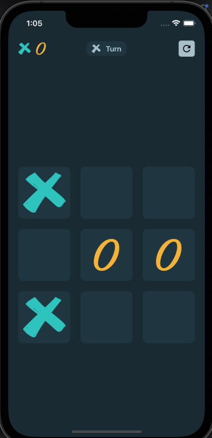
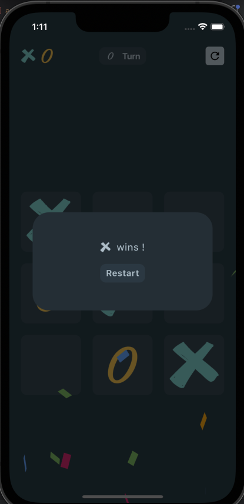
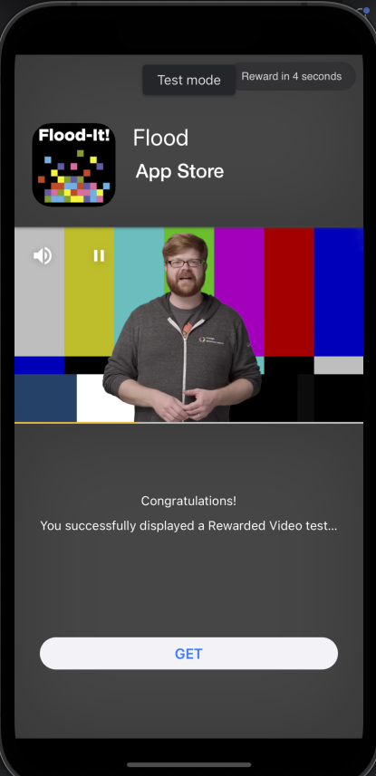

# Tic Tac Toe Flutter App 🎮

A simple **Tic Tac Toe** game built with **Flutter** and **GetX** for state management. This app allows two players to play on the same device and comes with an array of features, including a reset button, winner pop-up, confetti animation, and Google Ads integration.

## Features 🌟

- **🎮 Game Mode**: Play Tic Tac Toe with a friend on the same device.
- **🔄 App Bar Reset Button**: Reset the game anytime using the reset button in the app bar.
- **🏆 Winner Pop-up**: Shows who won when the game ends with a pop-up dialog.
- **🎉 Confetti Animation**: Celebrate the win with a confetti animation.
- **🔁 Restart Button**: The winner pop-up contains a button to restart the game.
- **💰 Google Ads Integration**: Displays Google Ads when the game is reset or restarted.
- **⚡ State Management with GetX**: Game state is managed efficiently using GetX for seamless and reactive updates.

## Screenshots 📸

### 1. **Game View**
Here is how the game screen looks when you start playing.


_The main screen where players interact with the Tic Tac Toe board._

### 2. **Confetti View**
This is the celebratory confetti animation that appears when a player wins.


_Confetti rain celebrating the victory! 🎉_

### 3. **Google Ad View**
Google Ad is shown when the game is reset or restarted.


_Screenshot of the Google Ad view._

## Prerequisites 🛠️

Before you begin, ensure you have the following installed:

- [Flutter SDK](https://flutter.dev/docs/get-started/install)
- [Android Studio or Visual Studio Code](https://flutter.dev/docs/get-started/editor)
- [Google AdMob Account](https://admob.google.com/home/) (for Ads setup)
- GetX dependency for state management in your `pubspec.yaml`:
  ```yaml
  dependencies:
    get: ^4.6.5 # or latest version
  ```

## Installation 🚀

1. Clone the repository:
   ```bash
   git clone https://github.com/parasbhanot938/tic_tac_toe.git
   ```

2. Navigate into the project directory:
   ```bash
   cd tic-tac-toe-flutter
   ```

3. Install dependencies:
   ```bash
   flutter pub get
   ```

4. Ensure you have an Android or iOS device/emulator running.

5. Run the app:
   ```bash
   flutter run
   ```

## Google Ad Integration 💵

To display Google Ads in your app, follow these steps:

1. Set up your [AdMob account](https://admob.google.com/home/) and create an ad unit ID.
2. Replace the placeholder AdMob ID in the code with your actual Ad Unit ID:
   ```dart
   final String adUnitId = 'your-admob-ad-unit-id';
   ```

3. Ensure you have the necessary dependencies in your `pubspec.yaml`:
   ```yaml
   dependencies:
     flutter:
       sdk: flutter
     google_mobile_ads: ^0.13.3 # or the latest version
     get: ^4.6.5 # for GetX state management
   ```

4. Follow the [Google Mobile Ads setup guide](https://pub.dev/packages/google_mobile_ads) for both Android and iOS platforms.

## GetX State Management ⚡

This app uses **GetX** to manage the game's state, making it reactive and easy to maintain.

### Key Concepts in the Game 🎮

1. **Controller**: A `GetxController` class is used to manage the state of the Tic Tac Toe board and current player. The controller holds:
    - The **game board** (a 3x3 grid).
    - **Current player** (either 'X' or 'O').
    - **Winner** state (if a player wins or if the game is a draw).
    - Methods to update the board and check for a winner after every move.

2. **Reactive State**: The app listens for changes in the state, updating the UI as the game progresses, with real-time updates when players make moves.

### Example Game Flow

1. **Game Start**: Players click on the cells of the Tic Tac Toe board to make their moves.
2. **State Update**: After each move, GetX updates the game state and checks for a winner.
3. **Winner Pop-up**: When a player wins, a dialog pops up displaying the winner, along with a restart option.
4. **Confetti Celebration**: A confetti animation appears when a player wins. 🎉
5. **Google Ad**: After resetting or restarting the game, a Google Ad is shown.

## How to Play 🎲

1. **Start the Game**: Players take turns to place their mark ('X' or 'O') on the grid.
2. **Check for Winner**: The game automatically checks for a winner after each move.
3. **Winner Display**: Once a player wins, a pop-up dialog shows the winner, with an option to restart the game.
4. **Confetti Animation**: A colorful confetti animation plays when the game ends in a win.
5. **Restart Game**: Tap the restart button to start a fresh game and enjoy the fun again!
6. **Google Ad**: After resetting or restarting, a Google Ad will appear.

